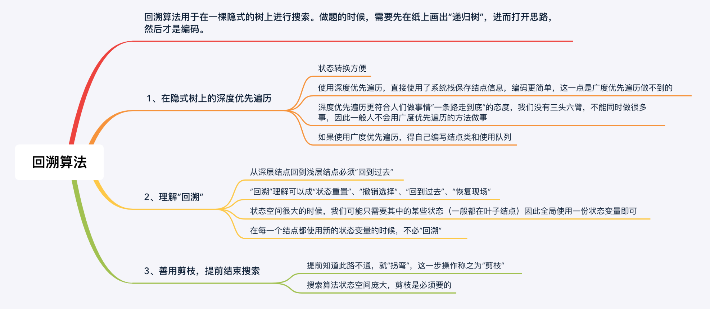

#学习笔记
----
###Java 递归模板  
• 递归终结条件  
• 处理当前层逻辑  
• 下探到下一层  
• 清理当前层  
``` Java
    public void recur(int level, int param) {
        //terminator
        if (level > MAX_LEVEL) {
            //process result
            return;
        }
        
        //process current logic
        process(level, param);
        
        //drill down
        recur(level: level+1,newParam);
        
        //restore current status
        
    }
```    
###递归思维要点  
• 不要人肉递归（最大误区）<br/>
• 找到最近最简方法，将其拆解成可以重复解决的问题（重复子问题）<br/>
• 数学归纳法<br/>
    
分治的递归模板  Didide & Conquer template:
 
        //1. terminator
        //2. process (split your big problem)
        //3. drill down (sub-problems)
        //4. merge(sub-result)
        //5. reverse states
        
    # Python
    def divide_conquer(problem, param1, param2, ...): 
      # recursion terminator 
      if problem is None: 
        print_result 
        return 
      # prepare data 
      data = prepare_data(problem) 
      subproblems = split_problem(problem, data) 
      # conquer subproblems 
      subresult1 = self.divide_conquer(subproblems[0], p1, ...) 
      subresult2 = self.divide_conquer(subproblems[1], p1, ...) 
      subresult3 = self.divide_conquer(subproblems[2], p1, ...) 
      …
      # process and generate the final result 
      result = process_result(subresult1, subresult2, subresult3, …)
    	
      # revert the current level states
      
      
###回溯   
    每一层不断尝试，以获取可能的解
    只需要思考 3 个问题：      
    1、路径：也就是已经做出的选择。     
    2、选择列表：也就是你当前可以做的选择。     
    3、结束条件：也就是到达决策树底层，无法再做选择的条件。  
    
    回溯模板：  
   
    ```
    result = [];
    public void backtrack(路径, 选择列表){
        if 满足结束条件:
            result.add(路径);
            return;
        
        for 选择 in 选择列表:
            做选择;
            backtrack(路径, 选择列表);
            撤销选择;
    }
    ```
    其核心就是 for 循环里面的递归，在递归调用之前「做选择」，在递归调用之后「撤销选择」

    列题：反转链表：
    这个BFS的讨论想和大家再重申一下
    1. 初始化一个队列
    2. 队列中先把第一个节点放进去，作为启动节点，不然后面没法while启动起来
    3. 队列中出一个节点，处理，然后把它的所有子节点拿出来，依次放入队列中
    ###
    总结
    1. 初始节点在循环外放进去
    2. 处理节点逻辑和生成子节点逻辑放到循环内

我做题的时候，第 1 步都是先画图，画图是非常重要的，只有画图才能帮助我们想清楚递归结构，想清楚如何剪枝。就拿题目中的示例，想一想人手动操作是怎么做的，一般这样下来，这棵递归树都不难画出。
即在画图的过程中思考清楚：

1、分支如何产生；  
2、题目需要的解在哪里？是在叶子结点、还是在非叶子结点、还是在从跟结点到叶子结点的路径？  
3、哪些搜索是会产生不需要的解的？例如：产生重复是什么原因，如果在浅层就知道这个分支不能产生需要的结果，应该提前剪枝，剪枝的条件是什么，代码怎么写？


题目	提示
47. 全排列 II	思考一下，为什么造成了重复，如何在搜索之前就判断这一支会产生重复，从而“剪枝”。
17 .电话号码的字母组合	
22. 括号生成	这是字符串问题，没有显式回溯的过程。这道题广度优先遍历也很好写，可以通过这个问题理解一下为什么回溯算法都是深度优先遍历，并且都用递归来写。
39. 组合总和	使用题目给的示例，画图分析。
40. 组合总和 II	
51. N皇后	其实就是全排列问题，注意设计清楚状态变量。
60. 第k个排列	利用了剪枝的思想，减去了大量枝叶，直接来到需要的叶子结点。
77. 组合	组合问题按顺序找，就不会重复。并且举一个中等规模的例子，找到如何剪枝，这道题思想不难，难在编码。
78. 子集	为数不多的，解不在叶子结点上的回溯搜索问题。解法比较多，注意对比。
90. 子集 II	剪枝技巧同 47 题、39 题、40 题。
93. 复原IP地址	
784. 字母大小写全排列	

作者：liweiwei1419
链接：https://leetcode-cn.com/problems/permutations/solution/hui-su-suan-fa-python-dai-ma-java-dai-ma-by-liweiw/