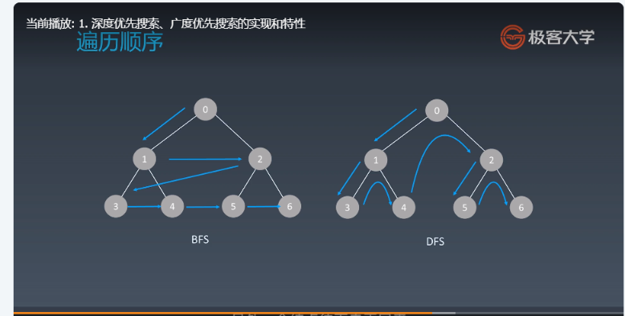

学习笔记

DFS 代码模板  
递归状态树的理解：dfs会马上进入到下一层，不用等到for循环，等dfs遇到return才会进入for循环下一个  
```$xslt
visited = set() 
def dfs(node, visited):
    if node in visited: # terminator
    	# already visited 
    	return 
	visited.add(node) 
	# process current node here. 
	...
	for next_node in node.children(): 
		if next_node not in visited: 
			dfs(next_node, visited)
```
非递归写法:  
```
def DFS(self, tree): 
   	if tree.root is None: 
   		return [] 
   	visited, stack = [], [tree.root]
   	while stack: 
   		node = stack.pop() 
   		visited.add(node)
   		process (node) 
   		nodes = generate_related_nodes(node) 
   		stack.push(nodes) 
   	# other processing work 
   	...
```

## BFS 代码模板
```$xslt
# Python
def BFS(graph, start, end):
    visited = set()
	queue = [] 
	queue.append([start]) 
	while queue: 
		node = queue.pop() 
		visited.add(node)
		process(node) 
		nodes = generate_related_nodes(node) 
		queue.push(nodes)
	# other processing work 
	...

```


#二分查找
二分查找的前提  
1. 目标函数单调性 （单调递增或递减）
2. 存在上下界 （bounded)
3. 能够通过索引访问 （index accessible)